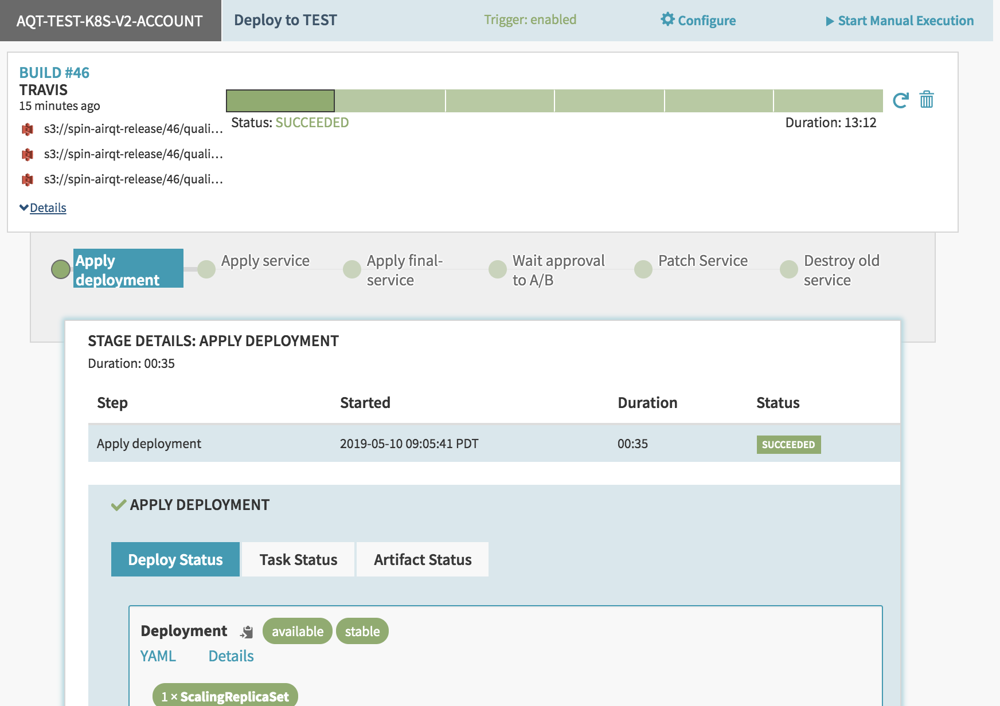
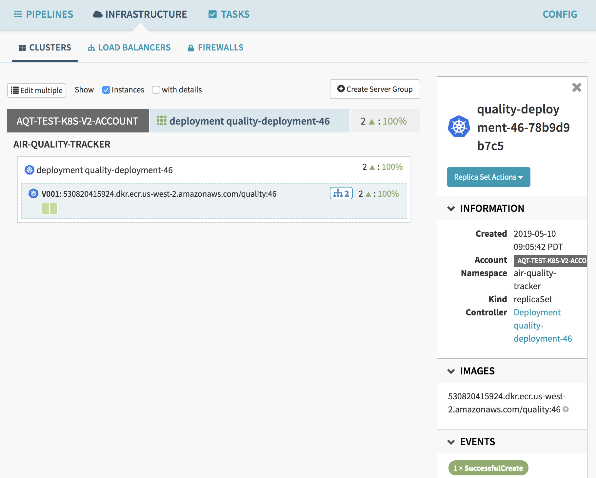
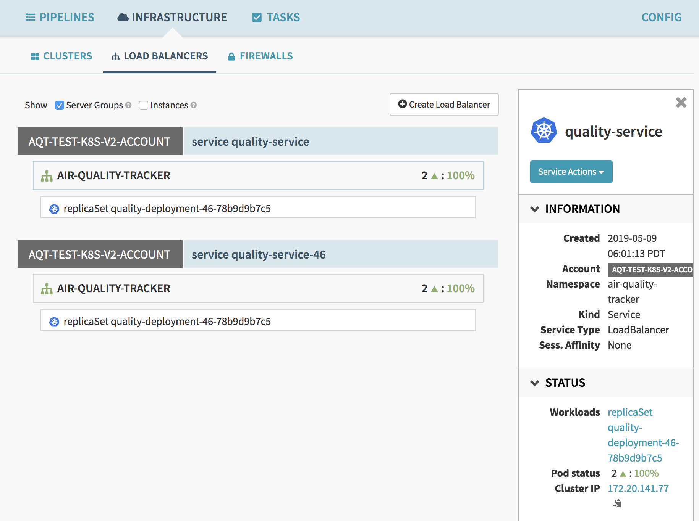

# Blue/Green deployments on EKS with Spinnaker

Blue/Green deployments provide near zero-downtime release and rollback capability. The fundamental idea behind blue and green deployment is to shift traffic between two identical environments that are running different version of your application.

With Spinnaker we can easily implement blue/green deployment. I'll walk you through the detail steps to implement blue/green deployment on top of EKS with Spinnaker. Spinnaker doesn't support blue/green deployment and has to implement by controlling manifest.

If want to know more about other strategies of deployments, please stay in the tune.

## Basic flow

GitHub -> Tavis CI (Release on S3) ->  Spinnaker
> Apply Deployment to TEST -> Apply Service to TEST -> Validating -> Patch Service -> Destroy OLD Service

## How to configure

1. Add GitHub webhook to Spinnaker.
2. Add GitHub webhook to Tavis CI. 
3. Add Tavis CI webhook to Spinnaker. 
4. Configure pipeline as per above flow.

## Example screen shots

