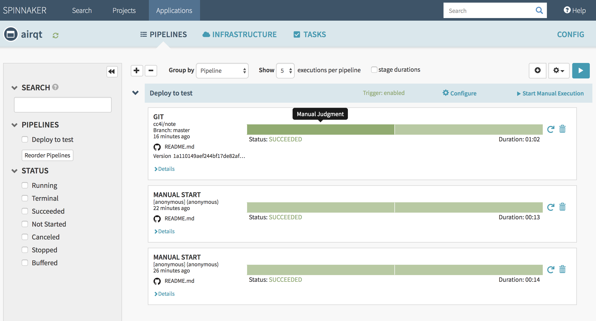

> draft@

# Description

Spinnaker is one of popular tooling for continuous deployment/delivery. The following experiment of CI/CD process will leverage the power of Spinnaker to address some key scenarios, mainly focus on containerize applications on Kubernetes.


# Prerequisite

## Initial EKS on AWS

Setup three different EKS clusters for test, staging and production environments. Spinnaker will be installed on test environment due to experimental purpose.

> [Initial EKS Cluster on AWS ... ...](EKS.md)

## Initial GKE on GCP

## Install Spinnaker on EKS

Install Halyard client ands Spinnaker on EKS cluster, as well as configure essential properties for following trials.

> [Install Spinnaker on EKS ... ...](Spinnaker.md)

## Configure Spinnaker
Configure Spinnaker to be able to publicly accessible, and integrate with GitHub, Travis CI, ECR, Amazon EKS, etc.

### Spinnaker with public access
```
kubectl edit svc spin-deck -n spinnaker
#type: LoadBalancer
#kubeclt describe svc spin-deck -n spinnaker|grep "LoadBalancer Ingress"
#loadBalancerIP:

kubectl edit svc spin-gate -n spinnaker
#type: LoadBalancer
#kubeclt describe svc spin-deck -n spinnaker|grep "LoadBalancer Ingress"
#loadBalancerIP: ...

hal config security ui edit \
    --override-base-url http://ac6fece6c68f811e98cb106e0fd571f9-1964482335.us-west-2.elb.amazonaws.com:9000

hal config security api edit \
    --override-base-url http://ac275d6cb68f811e9b39002fecc04dad-144154736.us-west-2.elb.amazonaws.com:8084

#hal deploy apply
```
>Note:

Add a file - gate.yml at ~/.hal/default/service-settings/ with following content - "overrideBaseUrl: http://ac275d6cb68f811e9b39002fecc04dad-144154736.us-west-2.elb.amazonaws.com:8084" if not working (still access http://localhost:8084).


###

### GitHub with access token
```
TOKEN=?
TOKEN_FILE=./git.token2
ARTIFACT_ACCOUNT_NAME=cc4i-github-artifact-account
echo $TOKEN > $TOKEN_FILE
hal config features edit --artifacts true
hal config artifact github enable

hal config artifact github account add $ARTIFACT_ACCOUNT_NAME \
    --token-file $TOKEN_FILE

#hal deploy apply
```

### Configure GitHub webhook for the repository
In the repository of GitHub, navigate to Settings > Webhooks > Add Webhook.

```
Payload URL : $ENDPOINT(Gate of Spinnaker)/webhooks/git/github

Content type : application/json

Secret :
```

https://www.spinnaker.io/setup/triggers/github/


### Travis CI
```
hal config ci travis enable
hal config features edit --travis true

hal config ci travis master add my-travis-master \
  --address https://api.travis-ci.org \
  --base-url https://travis-ci.org \
  --github-token \ # The GitHub token to authenticate to Travis
  --number-of-repositories 4

#hal deploy apply
```
https://www.spinnaker.io/setup/ci/travis/

### Configure the Script stage
https://eksworkshop.com/jenkinsworld/jenkins/prereqs/
https://www.spinnaker.io/guides/user/pipeline/expressions/
https://www.spinnaker.io/setup/features/script-stage/

### Artifacts by S3
```
hal config features edit --artifacts true
hal config artifact s3 enable

AWS_DEFAULT_REGION=us-west-2
AWS_ACCESS_KEY_ID=?

hal config artifact s3 account add artifacts-s3-account \
  --region $AWS_DEFAULT_REGION \
  --aws-access-key-id $AWS_ACCESS_KEY_ID \
  --aws-secret-access-key

```

### Amazon ECR
```
hal config provider docker-registry enable

#The Spinnaker instance running the Clouddriver service will also need permissions to interact #with the ECR repository. Attach the AmazonEC2ContainerRegistryReadOnly
#managed policy to the IAM role for your Spinnaker instance profile

aws iam attach-role-policy --policy-arn arn:aws:iam::aws:policy/AmazonEC2ContainerRegistryReadOnly --role-name <Spinnaker Instance Role>

hal config provider docker-registry account add crawler \
 --address $ADDRESS \
 --username AWS \
 --password-command "aws --region $REGION ecr get-authorization-token --output text --query 'authorizationData[].authorizationToken' | base64 -D | sed 's/^AWS://'"

```
https://docs.armory.io/spinnaker-install-admin-guides/ecr-registry/
https://docs.armory.io/admin-guides/configure_kubernetes/?gclid=CjwKCAjwwZrmBRA7EiwA4iMzBDvjRZaj5K0o6r0DjxqkNnpaBEyduTJyH_DsrPz_mFKy0vlUKcQR0hoCJdwQAvD_BwE


# Scenarios

## Configure Applications for Simple Deployment
Setup a simple application with pipeline to experience Spinnaker. Here is screen shot of first example. Easy!!!


High level process:
- [ ] Create an application
- [ ] Define the infrastructure the service will run on
- [ ] Create a pipeline
- [ ] Run your pipeline to deploy your service

For practice, and to see some sample deployment scenarios, check out : https://www.spinnaker.io/guides/user/get-started/

## Configure Applications for Blue/Green Deployment

## Configure Applications for Canary Deployment

## Configure Applications for Multiple Cloud

Deploy application to multiple cloud providers, in this case we'll use AWS and GCP as our targets. It's an excellent solution for continuous deployment on hybrid cloud infrastructure.

# Summary & Conclusion
